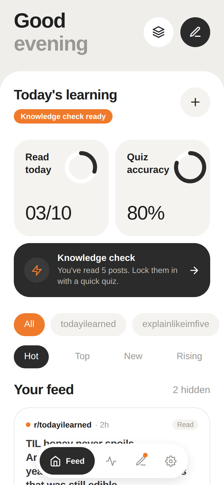
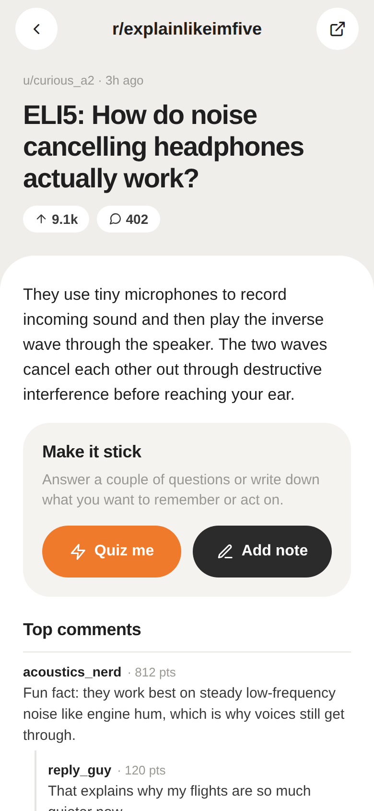
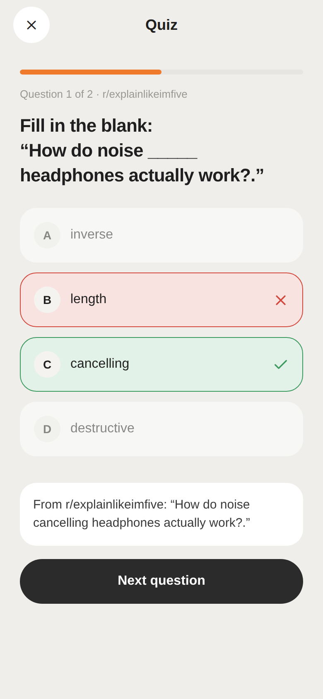
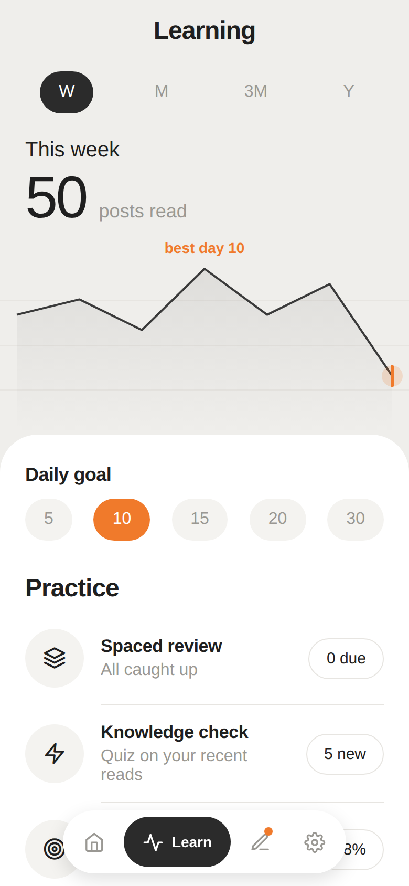
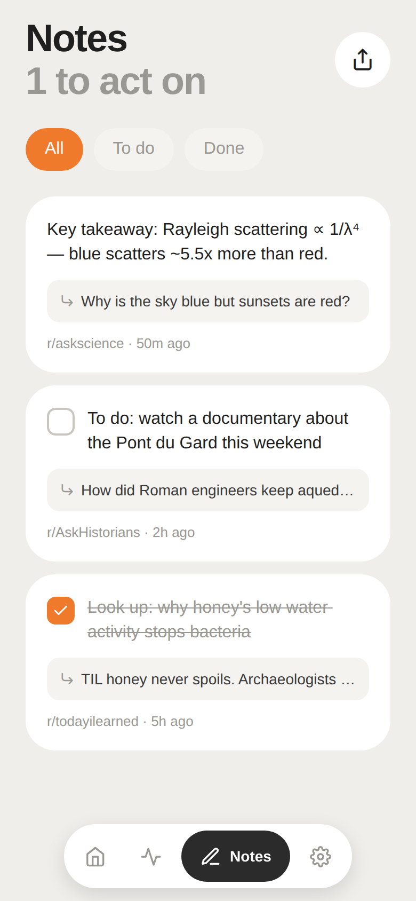
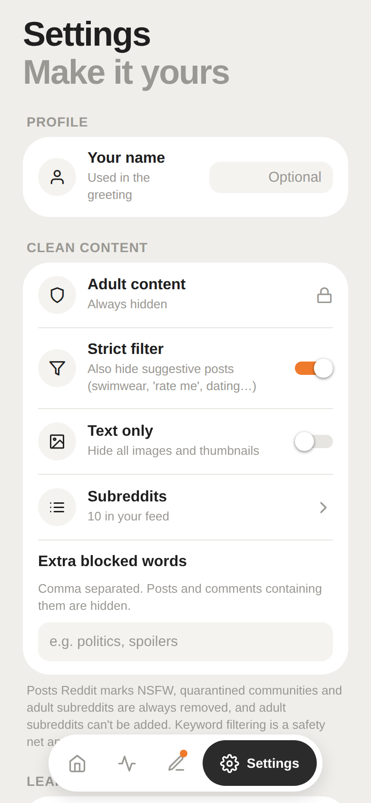

# Clean Reddit

A calm, family-friendly Reddit reader that helps you **remember what you read**.

- **No NSFW or sexually suggestive content.** It can't be turned off.
- **Learning built into scrolling.** Short quizzes, spaced review and reading stats.
- **Notes on any post.** Save a takeaway or a to-do, then come back and act on it.

<p>
  
  
  
  
  
  
</p>

## Download

### Web (any phone or computer)
Open **https://vladk-iii.github.io/clean-reddit/**. On a phone, use *Add to Home Screen* to get an app-like icon.

The site is redeployed every time `main` changes. **One-time setup:** in the repo, go to *Settings → Pages → Build and deployment → Source* and choose **GitHub Actions**.

### Android
1. Open the [Releases](../../releases) page and download the latest `clean-reddit-x.y.z.apk`.
2. Open the file on your phone. Allow "install unknown apps" for your browser or file manager if Android asks.

**To publish a new APK:** push a version tag. GitHub Actions builds the APK and attaches it to a release:

```bash
git tag v1.0.0
git push origin v1.0.0
```

You can also run the **Android APK** workflow by hand from the Actions tab. That build's APK is then under the run's *Artifacts*.

### iPhone
Apple doesn't allow installing apps from GitHub. You have two options:
- Run it in **Expo Go**, which is free on the App Store. Follow the steps under *Development* below and scan the QR code.
- Build it yourself with an Apple developer account (`npx eas-cli build -p ios`).

## Features

### Clean content
The filter has several layers, from most to least reliable:

1. **Reddit's own flags.** Reddit marks some posts as NSFW (over 18) and some communities as quarantined. Those are always removed.
2. **Blocked communities and links.** Adult subreddits and adult websites are blocked. When you add a subreddit, the app asks Reddit whether it's marked as adult, and refuses it if so.
3. **Keyword filter.** Explicit words are checked in post titles, post text, flair and comments. Strict mode is on by default and also catches suggestive posts (swimwear, "rate me", dating and so on).
4. **Your own words.** You can add more blocked words, and turn on **Text only** to hide every image.

The default feed is made of learning-focused communities: TIL, ELI5, AskScience, AskHistorians, Space and others. The keyword filter is a safety net, not a guarantee. Layers 1 and 2 do most of the work.

### Learning
- **Quiz me** on any post. You get fill-in-the-blank questions made from the post's own text, plus "which community was this from?". These work offline.
- **AI questions (optional).** In Settings, turn on AI questions and paste your own [Anthropic API key](https://console.anthropic.com/). Claude then writes comprehension questions about the post and its top comments. The key is stored only on your phone. If the AI call fails, the app falls back to the offline questions.
- **Knowledge check.** After every *N* posts you read (3, 5 or 10), the feed offers a quick quiz on what you just read.
- **Spaced review.** Every question you answer is saved as a review card. Wrong answers come back the next day. Right answers come back after 3, 7, 16 and then 35 days.
- **Learning tab.** Posts read per week, month, quarter or year, quiz accuracy, your reading streak and a daily reading goal.

### Notes
- Tap the pencil on any post, in the feed or on the post page, to write a note. Quick starters help: *Key takeaway*, *To do*, *Look up*, *Question*, *In my own words*.
- Mark a note as an **action item** and it shows up under **To do** until you tick it off.
- **Note after reading** (Settings): when you leave a post, a note screen opens so you can capture what matters before moving on.
- Use the share button to export your notes, with links back to the posts.

### Privacy
There are no accounts and no analytics. Notes, reading history, quiz cards and settings are stored only on your device. The app talks only to `reddit.com`, plus `api.anthropic.com` if you turn on AI questions.

## If posts don't load
Reddit sometimes blocks anonymous apps. To fix it:
1. Go to [reddit.com/prefs/apps](https://www.reddit.com/prefs/apps) and create an app of type **installed app**. You can use any redirect URI, for example `http://localhost`.
2. Copy its client ID (the short string under the app name).
3. In the app, open **Settings → Reddit connection** and paste it.

You don't need to log in to Reddit. The app uses application-only access.

## Development

```bash
npm install
npm start          # then press "a" for Android, or scan the QR code with Expo Go
npm test           # unit tests: content filter, quiz generator, stats
npm run typecheck
npm run lint
```

Built with Expo SDK 57, React Native and Expo Router.

```
src/
  app/                 screens (Expo Router)
    (tabs)/            Feed, Learn, Notes, Settings
    post/[id].tsx      post + comments + "Make it stick"
    quiz.tsx           post quiz / knowledge check / spaced review
    note.tsx           note editor
    subreddits.tsx     manage subreddits (adult ones refused)
  components/          UI kit (pills, tiles, progress rings, chart, post card)
  lib/
    filter.ts          content filter
    reddit.ts          Reddit API client (public JSON or app-only OAuth)
    quiz.ts            offline question generator + spaced repetition
    ai.ts              optional Claude-generated questions
    store.tsx          on-device storage (settings, notes, history, cards, stats)
    theme.ts           design tokens
```

### Design
The visual language follows a soft, minimal smart-home dashboard style:
- a warm off-white canvas, with white panels that have large rounded top corners;
- grey stat tiles with progress rings;
- near-black selected chips, and a single orange accent for highlights and the active filter.
